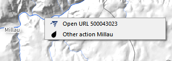

Hotlink-QGis-Plugin 
===================

Triggers [actions](https://docs.qgis.org/3.16/en/docs/training_manual/create_vector_data/actions.html) on single click

Purpose: To facilitate the use of actions attached to vector layers.

Principle: when the plugin is activated (button in the toolbar), the objects "carriers" of actions become "clickable". The associated action is triggered immediately if it is only. A list is available if necessary.
Tips are built from the layer properties (map tip display text option). Layer name + field are concatenated, or HTML version if defined as.

Attention : Since v0.7.7, Tips are not displayed because of conflict with default qgis map tip. To restore, change 'optionShowTips' variable in qgis2.ini.

    [Hotlink]
    optionShowTips=true

Release on QGIS Python Plugins Repository : http://plugins.qgis.org/plugins/Hotlink/

Exemple :

